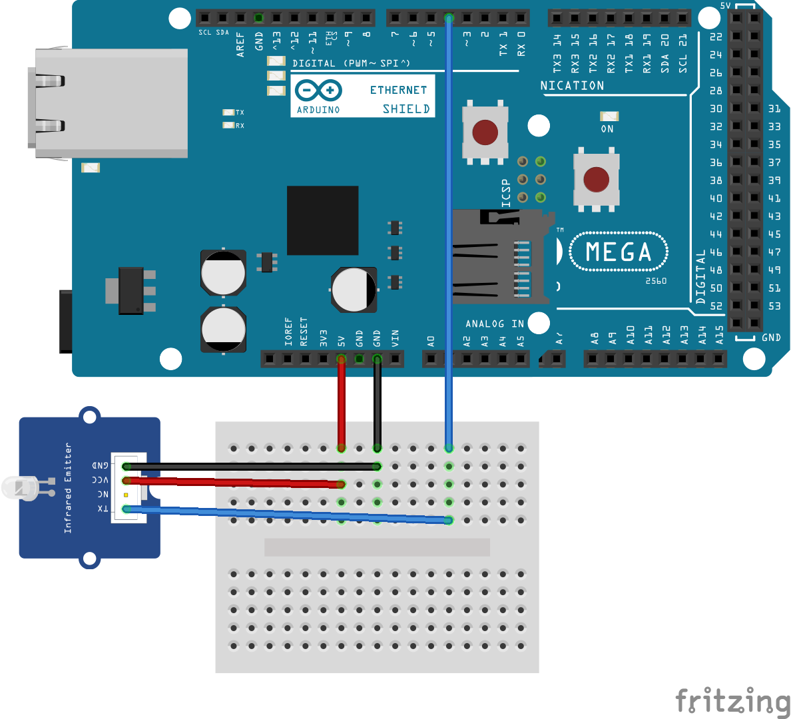

# Rest APIによる赤外線リモコン

本スケッチはArduion等に赤外線LEDを接続し，赤外線リモコンの代わりに用いるもので，どの赤外線信号を発生させるかの指示をRest APIへのGETアクセスで指示してもらう．

Rest APIは``http://IPv4アドレス/プロトコル名?第1引数&第2引数&第3引数&第4引数``の形式を取る．

## 利用例

開発環境(部屋)にはNECプロトコルで制御するLEDライトがあり，このLEDライトを制御する場合以下のようなコマンド(wget利用)を実行すれば良い．

```
on      wget "http://IPv4アドレス/nec?28034&189&5&0"
off     wget "http://IPv4アドレス/nec?28034&190&5&0"
明るく  wget "http://IPv4アドレス/nec?28034&186&5&0"
暗く    wget "http://IPv4アドレス/nec?28034&187&5&0"
青系    wget "http://IPv4アドレス/nec?28034&172&5&0"
白系    wget "http://IPv4アドレス/nec?28034&173&5&0"
茶系    wget "http://IPv4アドレス/nec?28034&174&5&0"
保安球  wget "http://IPv4アドレス/nec?28034&188&5&0"
```

上のコマンドで実行される[IRremote](https://www.arduino.cc/reference/en/libraries/irremote/)の[API](https://arduino-irremote.github.io/Arduino-IRremote/classIRsend.html)は以下のものであり，コマンドでは各引数の値を10進数で指定する．

```
void IRsend::sendNEC(uint16_t aAddress, uint8_t aCommand, uint_fast8_t aNumberOfRepeats, bool aIsRepeat = false)
```

## サポートしている[IRremote](https://www.arduino.cc/reference/en/libraries/irremote/)の機能(API)

本スケッチでサポートしている[IRremote](https://www.arduino.cc/reference/en/libraries/irremote/)のAPIとRest APIの対応関係は以下の表の通り．

| rest API名 | 対応するIRremoteの関数名 |
|---|---|
| apple               | void IRsend::sendApple(uint8_t aAddress, uint8_t aCommand, uint_fast8_t aNumberOfRepeats, bool aIsRepeat = false) |
| biPhase             | void IRsend::sendBiphaseData(unsigned int aBiphaseTimeUnit, uint32_t aData, uint_fast8_t aNumberOfBits) |
| bosewave            | void IRsend::sendBoseWave(uint8_t aCommand, uint_fast8_t aNumberOfRepeats = NO_REPEATS) |
| denon               | void IRsend::sendDenon(uint8_t aAddress, uint8_t aCommand, uint_fast8_t aNumberOfRepeats, bool aSendSharp = false) |
| denon2              | void IRsend::sendDenon(unsigned long data, int nbits) |
| dish                | void IRsend::sendDISH(unsigned long data, int nbits) |
| jvc                 | void IRsend::sendJVC(unsigned long data, int nbits, bool repeat = false) |
| jvcMSB              | void IRsend::sendJVCMSB(unsigned long data, int nbits, bool repeat = false) |
| kaseikyo            | void IRsend::sendKaseikyo(uint16_t aAddress, uint8_t aData, uint_fast8_t aNumberOfRepeats, uint16_t aVendorCode) |
| kaseikyo_denon      | void IRsend::sendKaseikyo_Denon(uint16_t aAddress, uint8_t aData, uint_fast8_t aNumberOfRepeats) |
| kaseikyo_jvc        | void IRsend::sendKaseikyo_JVC(uint16_t aAddress, uint8_t aData, uint_fast8_t aNumberOfRepeats) |
| kaseikyo_mitsubishi | void IRsend::sendKaseikyo_Mitsubishi(uint16_t aAddress, uint8_t aData, uint_fast8_t aNumberOfRepeats) |
| kaseikyo_sharp      | void IRsend::sendKaseikyo_Sharp(uint16_t aAddress, uint8_t aData, uint_fast8_t aNumberOfRepeats) |
| legoPowerFunction   | void IRsend::sendLegoPowerFunctions(uint8_t aChannel, uint8_t tCommand, uint8_t aMode, bool aDoSend5Times = true) |
| legoPowerFunction2  | void IRsend::sendLegoPowerFunctions(uint16_t aRawData, uint8_t aChannel, bool aDoSend5Times = true) |
| legoPowerFunction3  | void IRsend::sendLegoPowerFunctions(uint16_t aRawData, bool aDoSend5Times = true) |
| lg                  | void IRsend::sendLG(uint8_t aAddress, uint16_t aCommand, uint_fast8_t aNumberOfRepeats, bool aIsRepeat = false, bool aUseLG2Protocol = false) |
| lg2                 | void IRsend::sendLG(unsigned long data, int nbits) |
| magiQuest           | void IRsend::sendMagiQuest(uint32_t wand_id, uint16_t magnitude) |
| nec                 | void IRsend::sendNEC(uint16_t aAddress, uint8_t aCommand, uint_fast8_t aNumberOfRepeats, bool aIsRepeat = false) |
| nec2                | void IRsend::sendNEC(uint32_t aRawData, uint8_t nbits) |
| necMSB              | void IRsend::sendNECMSB(uint32_t data, uint8_t nbits, bool repeat = false) |
| onkyo               | void IRsend::sendOnkyo(uint16_t aAddress, uint16_t aCommand, uint_fast8_t aNumberOfRepeats, bool aIsRepeat = false) |
| panasonic           | void IRsend::sendPanasonic(uint16_t aAddress, uint8_t aData, uint_fast8_t aNumberOfRepeats) |
| panasonic2          | void IRsend::sendPanasonic(uint16_t aAddress, uint32_t aData) |
| rc5                 | void IRsend::sendRC5(uint8_t aAddress, uint8_t aCommand, uint_fast8_t aNumberOfRepeats, bool aEnableAutomaticToggle = true) |
| rc5_2               | void IRsend::sendRC5(uint32_t data, uint8_t nbits) |
| rc5ext              | void IRsend::sendRC5ext(uint8_t addr, uint8_t cmd, bool toggle) |
| rc6                 | void IRsend::sendRC6(uint8_t aAddress, uint8_t aCommand, uint_fast8_t aNumberOfRepeats, bool aEnableAutomaticToggle = true) |
| rc6_2               | void IRsend::sendRC6(uint32_t data, uint8_t nbits) |
| samsung             | void IRsend::sendSamsung(uint16_t aAddress, uint16_t aCommand, uint_fast8_t aNumberOfRepeats, bool aIsRepeat = false) |
| samsung2            | void IRsend::sendSAMSUNG(unsigned long data, int nbits) |
| sharp               | void IRsend::sendSharp(uint8_t aAddress, uint8_t aCommand, uint_fast8_t aNumberOfRepeats) |
| sharp2              | void IRsend::sendSharp(unsigned int address, unsigned int command) |
| sony                | void IRsend::sendSony(uint16_t aAddress, uint8_t aCommand, uint_fast8_t aNumberOfRepeats, uint8_t numberOfBits = SIRCS_12_PROTOCOL) |
| sony2               | void IRsend::sendSony(unsigned long data, int nbits) |
| whynter             | void IRsend::sendWhynter(unsigned long data, int nbits) |

## 動作環境

| CPUアーキ | 機種                                       | コンパイル | IRremoteでの受信 | 実機での確認 |
|---|---|---|---|---|
| AVR系     | Arduino Mega 2560 R3 + イーサネットシールド | ○         | ○ | △(対象装置限定) |
| SAMD系    | Arduino MKR WiFi 1010                     | ○         | ○ | × |
| ESP32     | ESP32 dev kit                             | ○         | ○ | × |
| ESP8266   | ESP8266 generic module                    | ○         | 未確認 | 未確認 |

Arduino Megaを用いた場合は，実際のLED電灯の制御ができていますが，Arduino MKR WiFi1010やESP32の開発用ボードでは，実機がうまくIRの信号を認識してくれていないようです．

IRremote自体は動作しているようで，別のArduinoで受信させると，意図したコマンドが出ていると認識してくれます．AVRの5Vで動作する機器以外での動作は今後の課題です．問題が使っているIR LEDなのか，IR remoteなのか今のところわかりません．

また，ESP8266は開発用のPCのUSBシリアルドライバの動作がおかしいため，インストールすらできていません．



上がこのスケッチの配線例ですが，赤外線LEDのピンは以下のピン番号の定義で変更できます．
```
#define IR_LED_PIN 4
```

## インストール
###  IDEのライブラリマネージャーを利用してインストールするライブラリ
- [IRremote](https://github.com/Arduino-IRremote/Arduino-IRremote)ライブラリ

### githubから自分でcloneする必要があるもの
- [RestServer](https://github.com/houtbrion/arduino-restserver.git)
    - このRest用ライブラリは[オリジナルRestServer](https://github.com/brunoluiz/arduino-restserver.git)を最新開発環境やWiFiに対応させたものです．

### ライブラリのconfig
[RestServer](https://github.com/houtbrion/arduino-restserver.git)の``src/RestSettings.h``を利用するネットワークインターフェイスによって変更します．

- 該当部分
```
//#define USE_UIPETHERNET
//#define USE_WIFI
```

上は，イーサネットを用いる場合かつ，「UIPETHERNET」ライブラリを利用する場合に有効化します．下は，WiFiを用いる場合に有効化してください．

### スケッチのカスタマイズ
以下にソースを引用しますが，DHCPを用いるか否かと固定IPの場合のIPアドレス，赤外線LEDを接続しているピン番号，WiFiのSSID等を自分が用いるハードウェアやネットワーク環境に合わせて変更してください．
```
/* ESP32はIR_SEND_PINが規定されているがそれ以外は自分でピンを決める */
#ifndef IR_SEND_PIN
#define IR_LED_PIN 4
#endif /* IR_SEND_PIN */

#define USE_DHCP

#define WIFI_SSID "foo"
#define WIFI_PASS "bar"

#ifndef USE_DHCP
IPAddress ip(192, 168, 1, 222);
IPAddress dnsServer(192, 168, 1, 1);
IPAddress gatewayAddress(192, 168, 1, 1);
IPAddress netMask(255, 255, 255, 0);
#endif /* USE_DHCP */
```

### 実機へのインストール
以上の手順が済んだら，IDEで実機にインストールしてください．


## 自分が持つ装置に送るべき，コマンドを調べる方法
赤外線受信モジュール(例:[Seed grove 赤外線受信機](https://jp.seeedstudio.com/Grove-Infrared-Receiver.html))をArduinoに接続し，[IRremote](https://github.com/Arduino-IRremote/Arduino-IRremote)ライブラリ付属の[受信サンプルスケッチ(ReceiveDump.ino)](https://github.com/Arduino-IRremote/Arduino-IRremote/tree/master/examples/ReceiveDump)を動作させてください．

その上で，調べる機器の赤外線リモコンをArduinoの近くで操作してください．

### 実機の操作
最初の「利用例」で用いたLED電灯の場合，以下のような出力が得られます．

- 電灯をつける
```
Protocol=NEC Address=0x6D82 Command=0xBD Raw-Data=0x42BD6D82 32 bits LSB first
```

- 消す
```
Protocol=NEC Address=0x6D82 Command=0xBE Raw-Data=0x41BE6D82 32 bits LSB first
```

- 明るく
```
Protocol=NEC Address=0x6D82 Command=0xBA Raw-Data=0x45BA6D82 32 bits LSB first
```

- 暗く
```
Protocol=NEC Address=0x6D82 Command=0xBB Raw-Data=0x44BB6D82 32 bits LSB first
```

- 青系色
```
Protocol=NEC Address=0x6D82 Command=0xAC Raw-Data=0x53AC6D82 32 bits LSB first
```

- 白熱灯色
```
Protocol=NEC Address=0x6D82 Command=0xAE Raw-Data=0x51AE6D82 32 bits LSB first
```

- ノーマル(白)色
```
Protocol=NEC Address=0x6D82 Command=0xAD Raw-Data=0x52AD6D82 32 bits LSB first
```

- 保安球
```
Protocol=NEC Address=0x6D82 Command=0xBC Raw-Data=0x43BC6D82 32 bits LSB first
```


### APIの調査
上の出力では，NECプロトコルであることがかわるため，[ドキュメントの該当部分](https://arduino-irremote.github.io/Arduino-IRremote/classIRsend.html#acc081690ddf61dec5d3f1c55000da7f5)を見ると，アドレスとコマンドがわかるため，下のAPIの利用が適切となります．

```
void IRsend::sendNEC(uint16_t aAddress, uint8_t aCommand, uint_fast8_t aNumberOfRepeats, bool aIsRepeat = false)
```

実機の出力からアドレスは``0x6D82``，コマンドは``0xBD``であるので，これを10進数に変換して，「``28034``」と「``189``」を利用します．
また，第3引数の``aNumberOfRepeats``は，同じコマンドを何回送るかを指定する引数であり，手元の機器で何回か繰り返して試したところ，5回程度で失敗がほぼ無くなることから，最初の例では第3引受を``5``にしています．第4引数(bool値)は元々のAPIのデフォルトが``false``であるため，それを踏襲して``false``に対応する``0``にしています．

bool値に関しては，「``0``が``false``」で「``0``以外が``true``」として取り扱われます．

また，``void IRsend::sendNEC(uint16_t aAddress, uint8_t aCommand, uint_fast8_t aNumberOfRepeats, bool aIsRepeat = false)``は上の対応表を見ると，``nec``ですので，wget "http://IPv4アドレス/nec?28034&189&5&0"でLED電灯をONにすることができます．


