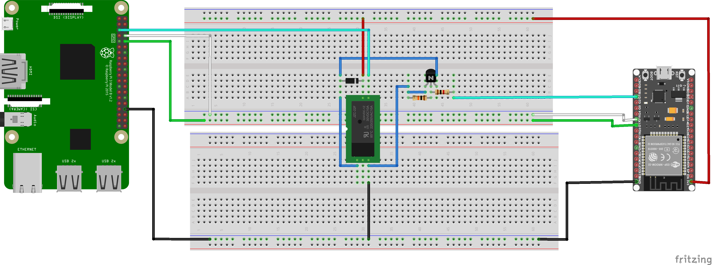
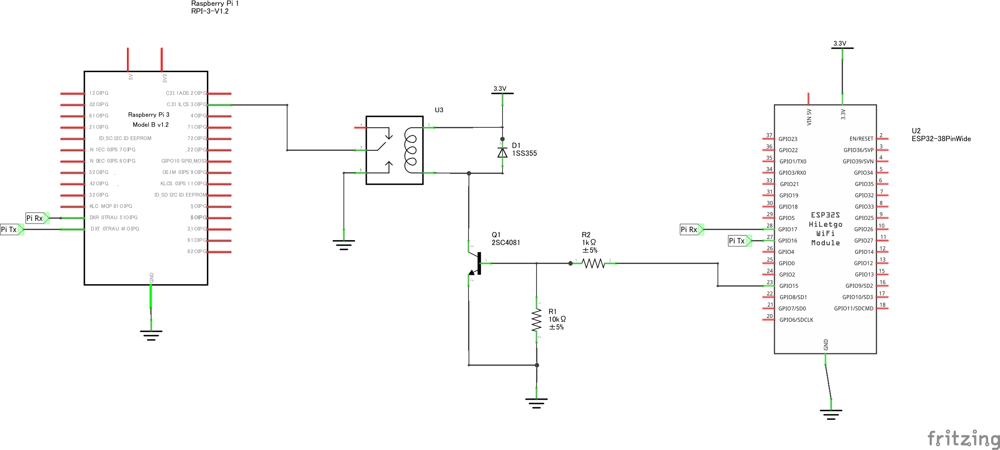

# telnet-serial

本プログラムは，Arduino(と互換機)をtelnetサーバとし，シリアルでUNIX系のサーバに接続することでコンソール接続をネットワーク越しに行うものです．

自宅では，Raspberry Piに外付けdiskをつけてファイルサーバにしていますが，ディスプレイやキーボードをつなぐのも面倒な上，シリアルコンソールを有効にしても，手元PCのUSBがそれで常時塞がるのも面倒だったことが理由の1つめです．

もう1つは，仕事関係でターミナルサーバも使いましたが，ターミナルサーバは高価，置き場所もとり，シリアル配線の取り回しも面倒だったため，こちらも開発のきっかけになっています．

開発対象がArduinoであること，自宅で使うこと，接続先のサーバの最低限の保守ができれば，その先はネットワーク経由でサーバにログインすれば良いため，telnet+最低限のメンテナンス作業ができれば良いという設計になっています．

## 対応プラットフォーム
下の表の環境で動作確認しています．

|CPUアーキ| 動作環境|
|---|---|
| AVR   | [Arduino Mega](https://store.arduino.cc/products/arduino-mega-2560-rev3) + [イーサネットシールド](https://store.arduino.cc/products/arduino-ethernet-shield-2) + [ロジックレベル変換回路(SparkFun BOB-12009)](https://www.sparkfun.com/products/12009) |
| SAMD  | [Arduino MKR WiFi 1010](https://store.arduino.cc/products/arduino-mkr-wifi-1010) |
| ESP32 | [ESPr One 32](https://www.switch-science.com/catalog/3555/) |


以下の環境は，コードは存在していますが，手元の[esp8266開発ボード](https://www.switch-science.com/catalog/2500/)と開発用のPCの接続がうまくいかず(FTDIのドライバの問題かと)，デバッグやテストができていません．FTDIのドライバ再インストールもうまくいっていません．
- ESP8266

## 使い方

telnetでArduinoに接続するとパスワードを聞かれる．
```
login password :
```

正しいパスワードを入力するとコマンドモードとなります．
```
login password : ****
network serial server.
Please input command.

Commands are :
 's' or 'S' - serial speed select menu.
 'o' or 'O' - open serial port.
 'r' or 'R' - reboot.
 'q' or 'Q' - terminate telnet connection.
 'h' or 'H' - print this help.
CM>
```
Arduinoとサーバ等の間のシリアルのパラメータに変更の必要がなければ``o``コマンドでシリアル接続に切り替わります．
```
login password : ****
network serial server.
Please input command.

Commands are :
 's' or 'S' - serial speed select menu.
 'o' or 'O' - open serial port.
 'r' or 'R' - reboot.
 'q' or 'Q' - terminate telnet connection.
 'h' or 'H' - print this help.
CM> o
Escape from communication code = Ctrl-q
```
以下は，シリアル接続している状態でArduinoと接続しているRaspberry Piの電源を入れた場合のログです．
```
[    8.968193] systemd[1]: Starting Create list of static device nodes for the current kernel...
[    9.000065] systemd[1]: Starting Load Kernel Module configfs...
[    9.024727] systemd[1]: Starting Load Kernel Module drm...
[    9.049338] systemd[1]: Starting Load Kernel Module fuse...
[    9.086873] systemd[1]: Condition check resulted in Set Up Additional Binary Formats being skipped.
stemd[1]: Mounted RPC Pipe File System.
[    9.346492] systemd[1]: Mounted Kernel Debug File System.
[    9.362461] systemd[1]: Mounted Kernel Trace File System.
[    9.380333] systemd[1]: Finished Restore / save the current clock.
[    9.399020] systemd[1]: Finished Create list of static device nodes for the current kernel.
[    9.424281] systemd[1]: modprobe@configfs.service: Succeeded.
[    9.436712] systemd[1]: Finished Load Kernel Module configfs.
[    9.453145] i2c /dev entries driver
us.
[    9.627713] systemd[1]: Starting Apply Kernel Variables...
[    9.673738] systemd[1]: Started Journal Service.
[   14.329310] Under-voltage detected! (0x00050000)

Raspbian GNU/Linux 11 raspberrypi ttyAMA0

raspberrypi login:
```
シリアル接続している状態で「Ctrl-q」を入力すると，コマンドモードに戻ります．

シリアル接続のデフォルトのパラメータは，115200bps，8bit，ノンパリティ，ストップビット1bitとなっています．もし，変更が必要な場合は，コマンドモードで「``s``」を入力し，シリアルのパラメータを変更します．シリアルパラメータの設定では，まず，速度を選択します．下の例では，デフォルトと同じですが，「``j``」を入力して115200bpsを選択しています．
```
CM> s

Serial port setting menu.
Select serial port speed :
 a -     300bps
 b -    1200bps
 c -    2400bps
 d -    4800bps
 e -    9600bps
 f -   19200bps
 g -   38400bps
 h -   57600bps
 i -   74800bps
 j -  115200bps
 k -  230400bps
 l -  250000bps
 m -  500000bps
 n - 1000000bps
 o - 2000000bps
CM> j
```
次に，速度以外のパラメータを選択する必要があり，ここではデフォルトの「``d``」(8bit, パリティなし, ストップビット1bit)を選択しています．
```
CM> j

Serial parameter selection :
 a - 5N1 5bit data, non parity, stop bit=1
 b - 6N1
 c - 7N1
 d - 8N1
 e - 5N2 5bit data, non parity, stop bit=2
 f - 6N2
 g - 7N2
 h - 8N2
 i - 5E1 5bit data, even parity, stop bit=1
 j - 6E1
 k - 7E1
 l - 8E1
 m - 5E2 5bit data, even parity, stop bit=2
 n - 6E2
 o - 7E2
 p - 8E2
 q - 5O1 5bit data, odd parity, stop bit=1
 r - 6O1
 s - 7O1
 t - 8O1
 u - 5O2 5bit data, odd parity, stop bit=2
 v - 6O2
 w - 7O2
 x - 8O2
CM> d
CM> 
```

他のコマンドですが，``r``はArduinoをリブートするコマンドで，``q``はtelnetを終了します．
```
Commands are :
 's' or 'S'        - serial speed select menu.
 'o' or 'O'        - open serial port.
 'r' or 'R'        - reboot.
 'q' or 'Q'        - terminate telnet connection.
 'x' or 'X'        - hard reset(target system).
 'h' or 'H' or '?' - print this help.
CM>
```

また，telnet接続したまま，なにも入力せず一定時間放置するとtelnetは終了します．

## インストール

### ハードウェアの準備
用意したArduino(もしくは互換機)とサーバを接続する際に用いるシリアルは以下のようになっています．

|CPUアーキ| 対象機器 | シリアルポート| RXピン | TXピン |
|---|---|---|---|---|
| AVR | Arduino Mega | Serial1  | 19 |18 |
| SAMD | MKR WiFi 1010 | Serial1 |13 |14 |
| ESP32 | ESPr one 32 | Serial2 | 16 | 17 |


### 依存するライブラリのインストール
- [detectArduinoHardware](https://github.com/houtbrion/detectArduinoHardware)
- detectArduinoHardwareのextensionディレクトリに収納されている拡張機能ライブラリarduinoHardwareHelper

もし，ESP8266で利用したい方はソフトウェアシリアルが必要になるため，以下のライブラリをインストールしてください．
- [EspSoftwareSerial](https://www.arduino.cc/reference/en/libraries/espsoftwareserial/)

### 設定

### WiFi設定
WiFiを利用する場合は，WiFiの設定を行ってください．
```
#define SSID_STR "SSID"
#define WIFI_PASS "SSIDのパスワード"
```

### イーサネットシールドを用いる場合
macアドレスは以下のところを手持ちのイーサネットシールドのmacアドレスに変更してください．
```
byte mac[] = { 0x90, 0xa2, 0xda, 0x10, 0x11, 0x51 }; //アドレスは手持ちのarduinoのものに変更すること
```

### パスワード設定
パスワードは平文で埋め込みになっています．デフォルトは3個のパスワード，パスワードの長さの最大値が16文字となっています．ご自分の環境に合わせて変更してください．
```
#define PASSWORD_LENGTH 16
#define PASSWORD1 "hoge"
#define PASSWORD2 "foo"
#define PASSWORD3 "bar"
#define PASSWD_NUM 3
```
```
char passwd[][PASSWORD_LENGTH]={PASSWORD1, PASSWORD2, PASSWORD3};
```

### タイムアウト時間の設定
デフォルトは5分(300000ミリ秒)telnet側からの入力がないと自動切断されるため，このパラメータを用途に合わせて変更します．
```
#define INPUT_TIMEOUT 300000
```

### リセットピンを使う場合の設定
Raspberry Piでは，OSをシャットダウンした状態でGPIOの3番ピン(I2Cと兼用)をGNDに落とすとOSのロードがされる仕様となっています．
この機能を使うための機能が実装されており，下に引用したように「USE_HARD_RESET_PIN」にArduino(もしくは互換機)のピン番号を定義しておくと，この機能がコンパイルされます．
```
#define USE_HARD_RESET_PIN 15 // Espr one 32のD2 これを定義すると、ハードリセットプログラムがコンパイルされる
#define HARD_RESET_TIME 1000  // 1秒(定義の単位はms)
```
この機能は，コマンドモードで「x」もしくは「X」を投入すると，「HARD_RESET_TIME」で定義された時間(単位はミリ秒)だけArduinoのピンの電圧がHIGHになります．Raspberry Piでリセットするためには，Arduino側の端子がHIGHになった場合に，Raspberry Pi側の端子がGND(LOW)になる必要があるため，変換の回路を取り付ける必要があります．

このような仕様になっている理由は，Arduinoや互換機が再起動した場合に端子の電圧がLOWに落ちてしまうため，Raspberry Piをシャットダウンした状態でArduinoを再起動できるようにするためです．

他にもこの機能の使いみちとしては，Raspberry Pi側で特定のピンの電圧を監視しておいて，HIGHになったらなにかをするという用途に転用することもできます．

Raspberry Pi以外でもBeagle Bone等の開発用ボードでは，この機能を活用できる可能性はありますが，詳細は調査していません．

### IP設定

#### DHCPを利用する場合
以下のコメントアウトを外してください．
```
//#define USE_DHCP
```

#### 固定IPの場合
以下の部分を自分の環境に合わせて変更してください．
```
IPAddress ip(192, 168, 1, 222);
IPAddress dnsServer(192, 168, 1, 1);
IPAddress gatewayAddress(192, 168, 1, 1);
IPAddress netMask(255, 255, 255, 0);
```

## ハード
ここでは，ESP32でこのプログラムを動作させ，Raspberry Piに接続して利用する場合のハードウェアを紹介します．最初の図はブレッドボードで作成した場合の回路になります．





利用した部材は以下の通りです．

| 種類 | 用いた部材/装置 | 備考 |
|---|---|---|
| 開発対象 | [スイッチサイエンス ESPr one 32](https://www.switch-science.com/catalog/3555/)|Arduino Uno系と基板の形が同じになっているESP32のマイコン|
|リレー関係| [リレーモジュール](https://akizukidenshi.com/catalog/g/gK-13573/)|リレーとトランジスタ，抵抗などコミコミのモジュール|
|制御される側のサーバ|[Raspberry Pi](https://www.raspberrypi.org/)|今回は家であまってるPi2を使いました|

### ESP32とRaspberry Piのシリアル接続
Raspberry Piとマイコンを接続する配線のうちシリアルの系統は，「[Raspberry pi pin map](https://docs.microsoft.com/en-us/windows/iot-core/learn-about-hardware/pinmappings/pinmappingsrpi)」と「[ESP32のpin map](https://randomnerdtutorials.com/esp32-pinout-reference-gpios/)」を参照してください．

大まかには，Raspberry PiのUARTとESP32のUART2を接続しています．UART0は開発でコンパイルしたバイナリのインストールや，ログの監視につかうため，それ以外で確実にバッティングしないシリアルということで，ESP32はUART2を使っています．それに対して，Raspberry PiはUARTは1つしかないので，そこを使っています．

### ハードウェアリセットの利用
本プログラムでは，ESP32のGPIO15番をshutdownしたRaspbery Piの再起動(ハードウェアリセット)に用いていますが，その原理については[こちらの参考文献](https://hammmm.hatenablog.com/entry/2016/11/14/231337)を参照してください．

ESP32自体をリセットすると，ESP32のピンの電圧がHIGH/LOWがパタパタするようで，Raspberry Piをshutdownしておき，ESP32のリセット(リセットボタン操作)を行うと，Raspberry Pi自体も起動してしまいます．

本プログラムでは，狙った時だけRaspberry PiのピンをGNDに落とす必要があるため，ESP32のピンをHIGHにした時だけ，Raspberry Piの特定ピンがGNDに落とすため，何らかのスイッチのようなものが必要になります．

そのため，今回の試作で使ったリレーの他，[アナログスイッチ](https://akizukidenshi.com/catalog/g/gI-05673/)も試して見ましたが，アナログスイッチは入力に対する応答性が良すぎて，ESP32のリブートによるピン電圧のパタ付きでRaspberry Pi側のピンがGNDに落ちてしまいました．

shutdownしたRaspberry Piをリブートすることが目的なので，頻繁に使うものでもなく，Raspberry Pi側のピンがI2Cと共用ということもあり，普段は完全に切り離すことができ，繰り返し利用の耐久性もそれほど必要ではないので，リレーで済ませてます．

### Raspberry Piのシリアルコンソール有効化
なお，Raspberry PiでUARTをシリアルコンソールにしていないと，本プログラムの嬉しさが半減してしまうので，UARTをコンソール(/dev/console)にして上げてください．設定方法はぐぐるとでてきますが，Raspberry Piの/boot/config.txtをエディタで編集する必要があります．

Pi2は下の2行のうち，上の行だけ(``enable_uart=1``)を/boot/config.txtに追加すればよく，Pi3は両方とも必要です．Pi4は使ったことがないので未確認です．
```
enable_uart=1
core_freq=250
```

## 将来課題
とりあえず，思いついているのは以下の3つですが，最初の一つはArduinoが再起動して，ピンの電圧がHIGH/LOWがパタパタするような状況でも電源回路が影響を受けないようにするのが面倒そうなので，今のところ実装のアイデアがないです．2番目と3番目は時間と気合次第でしょうか．現状手元では，3.3VのArduino (MKR系やESP32等)でSDを使うための部材がないので(ロジックレベル変換回路やSDの回路)，いつかお財布に余裕があるときに秋葉原で買い物してきます．これを書いている前日に行ったけど買い忘れたし，往復の電車/バス代などで千円以上するし～，コロナも怖いのでしばらく間を開けます．
- 外付け電源回路を制御して対象システム(Raspberry Pi等)の電源強制ON/OFFを行う
- telnetログイン時の認識をもっと柔軟/強力にする
- ログを残す(SDやネットワーク越しのsyslog)

